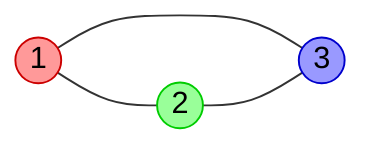

# Лекция 2. Сведение SAT

_Лекция написана студентом Соколовским Романом Вадимовичом из группы Б9123-01.03.02сп под руководством преподавателя Месенёва Павла Ростиславовича_

_В приведённом ниже материале используются термины и обозначения, введённые в [Лекции 1. Введение в NP](./../Лекция%201.%20Введение%20в%20NP/lecture.md)_

### Содержание

1. Полнота SAT
1. Сведение 3SAT к 3СOLOR
1. Сведение 3SAT к ISET
1. Источники

## 1. Полнота SAT

Проблема выполнимости, обозначаемая $SAT$, формулируется следующим образом: задана логическая формула $\phi$; определить, является ли она выполнимой. Очевидно, что $SAT \in NP$, т.к. удовлетворяющий набор значений переменных - это сертфикат $y$, и то, что $y$ действительно является удовлетворяющим набором значений переменных для $\phi$, может быть проверено за полиномиальное время.

Для начала стоит доказать, что $SAT$ является $NP$-Полной задачей, показав, что для каждого языка в $NP$ существует полиномиальное сведение к $SAT$. Тогда мы сможем утверждать, что любая задача, к которой сводится $SAT$ является $NP$-Полной. Почему это работает объяснено в [Лекции 1. Введение в NP](./../Лекция%201.%20Введение%20в%20NP/lecture.md).

**Теорема (С. Кук, Л. Левин).** $SAT$ является $NP$-Полной задачей.

> **Доказательство.** Рассмотрим только часть доказательства, так как это не основная тема лекции, а полная версия очень громоздкая.
>
> Рассмотрим задачу $A \in NP$. Она решается недетерминированной машиной Тьюринга $\mathfrak{M}$. Для удобства будет предполагать, что лента $\mathfrak{M}$ может увеличиваться бесконечно только вправо. Из определения $NP$, машина $\mathfrak{M}$ совершает не более $n^k$ шагов для успешного выполнения; мы можем утверждать, что длина ленты при вводе входных данных $x$ длины $n$ и далее на каждом шаге не превысит $n^k$, т.к. изначально головка $\mathfrak{M}$ стоит в начале ленты, двигается за один шаг максимум на одну ячейку вправо или влево и может в худшем случае сделать $n^k$ шагов вправо.
>
> Построим таблицу для данной $\mathfrak{M}$ и входных данных $x$. Пусть строки - это конфигурации машины (вид ленты) на кажом шаге, а столбцы - символы в соответсвутющей ячейке на каждом шаге. Для удобства доказательства в начало и конец ленты добавляют символ $\\#$. Вместе с символом состояния размер таблицы получается $(n^k + 3) \times (n^k + 3)$, но для удобства будем считать, что $n^k \times n^k$. Первая строка (стартовая конфигурация) имеет вид $(1)$:
>
> $$
> \begin{align*}
> \\# \ q_0 \ x_1 \ x_2 \ \ldots \ x_n \ \sqcup \ \ldots \ \sqcup \ \\# \\
> \longleftarrow n^k \longrightarrow
> \end{align*}
> $$
>
> Каждая следующая строка таблицы строится из предыдущей согласно правилам перехода в $\mathfrak{M}$.
>
> Таблица, построенная по этому приницпу, называется _принимающей_, если каждая строка является _принимающей_ конфигурацией. Иначе говоря, каждая принимающая таблица для $\mathfrak{M}$, построенная на входных данных $x$, соответствует успешному выполнению (одной из угаданных недетерминированной машиной ветке) при входных данных $x$. Таким, образом, задача определения того, принимает ли $\mathfrak{M}$ $x$, эквивалентна задаче определения того, существует ли принимающая таблица для $\mathfrak{M}$ на $x$.
>
> Далее строится булева формула $\phi$, разрешимость которой будет говорить о том, что таблица построенная на $\mathfrak{M}$ и $x$ является принимающей. Данная формула имеет вид:
>
> $$
> \phi = \phi_{cell} \wedge \phi_{start} \wedge \phi_{move} \wedge \phi_{accept}
> $$
>
> Здесь $\phi_{cell}$ требует, чтобы каждой ячейке в таблице соответствовала ровно одна переменная в формуле $\phi$; условие $\phi_{start}$ проверяет, чтобы стартовая конфигурация имела вид $(1)$; формула $\phi_{move}$ гарантирует, что все строки таблицы соответствуют правилам перехода $\mathfrak{M}$ и, наконец, $\phi_{accept}$ проверяет наличие состояния $q_F$ в последней строке. Вид самих формул опустим.
>
> Мы свели изначальный алгоритм проверки $x \in A$ к булевой формуле $\phi$. Теперь необходимо оценить количество переменных в формуле и время генерации этой формулы. Это мы также опустим и поверим, что $\phi$ строится за полиномиальное время на основе входных данных $x$.
>
> Таким образом, для каждого языка из $NP$ существует полиномиальное сведение к $SAT$. Следовательно, $SAT$ является $NP$-Полной задачей. ✌️

Всё это хорошо, но $SAT$ в некоторых случаях не очень удобен для сведения его к другим задачам, в отличии от его частного случая - $3SAT$. Формулы $3SAT$ являются КНФ с тремя переменными в одном из клозов $C_i, i \in \mathbb{N}$. Покажем, что $3SAT$ является $NP$-Полной задачей, путём доказательства существования полиномиального сведения $SAT$ к $3SAT$.

**Теорема (Г. Цейтин).** Для каждой булевой формулы $\phi$ существует равновыполнимая $3КНФ$ формула $\psi$, которая может быть вычислена за полиномиальное время.

> **Замечание.** _Равновыполнимость_ значит, что $\phi$ выполнима тогда и только тогда, когда $\psi$ выполнима (либо они обе удовлетворимые либо обе нет). Это более слабое условие в отличие от эквивалентности. Построить эквивалетную $3КНФ$ формулу не всегда представляется возможным или её построение может вести к экспоненциальному времени.

> **Доказательство (Трансформация Цейтина).** Для каждой подформулы (кроме простых переменных) $\xi_i$ у $\phi$ мы вводим новую переменную $t_i$ и соединяем её с этой подформулой эквивалентностью: $t_i \leftrightarrow \xi_i$. Например, для формулы $(p \rightarrow q) \vee (q \rightarrow (p \rightarrow q))$ полученные эквивалентнсти имеют вид:
>
> $$
> \begin{align*}
> t_1 &\leftrightarrow (p \rightarrow q) \\
> t_2 &\leftrightarrow (p \rightarrow r) \\
> t_3 &\leftrightarrow (q \rightarrow t_2) \\
> t_4 &\leftrightarrow (t_1 \vee t_3)
> \end{align*}
> $$
>
> Пусть последняя эквивалентность $t_n$ (в примере $n = 4$) соответсвует формуле $\phi$. Тогда коньюнкция всех эквивалентностей плюс t_n будет равновыполнима с $\phi$. То есть для нашего примера $\phi = t_4 \wedge (t_4 \leftrightarrow (t_1 \vee t_3)) \wedge (t_3 \leftrightarrow (q \rightarrow t_2)) \wedge (t_2 \leftrightarrow (p \rightarrow r)) \wedge (t_1 \leftrightarrow (p \rightarrow q))$. После раскрытия эквивалентностей получим КНФ формулу с не более чем тремя переменными в одном клозе, т.к.
>
> $$
> \begin{align*}
> t_k &\leftrightarrow (t_i \wedge t_j) \equiv (\overline{t_i} \vee \overline{t_j} \vee t_k) \wedge (t_i \vee \overline{t_k}) \wedge (t_j \vee \overline{t_k})\\
> t_k &\leftrightarrow (t_i \vee t_j) \equiv (t_i \vee t_j \vee \overline{t_k}) \wedge (\overline{t_i} \vee t_k) \wedge (\overline{t_j} \vee t_k)\\
> t_k &\leftrightarrow (t_i \rightarrow t_j) \equiv (\overline{t_i} \vee t_j \vee t_k) \wedge (t_i \vee t_k) \wedge (\overline{t_j} \vee t_k) \\
> t_k &\leftrightarrow \overline{t_i} \equiv (t_i \vee t_k) \wedge (\overline{t_i} \vee \overline{t_k})
> \end{align*}
> $$
>
> Время выполнения такого алгоритма линейное (т.е. полиномиальное), т.к. мы просто итерируемся по всем операциям, составляя новую формулу. Таким образом, $SAT \leq_P 3SAT$ и $3SAT$ является $NP$-Полной задачей.

Также полезно будет рассмотреть методы для сокращения клозов длины $m > 3$ до двух-трёх переменных.

> **Метод 1. Рекурсивный.** Одним из способов сокращения клозов длины $m$ является рекурсивный метод, который позволяет получить клозы длины $m−1$ и другие более короткие предложения путем введения новой переменной (Kabanets, 2007):
>
> $$
> \begin{align*}
> (x_1 \vee x_2 \vee \ldots \vee x_m) = &(\overline{y} \vee x_1 \vee \ldots \vee x_{m-2}) \ \wedge \\
> &(y \vee \overline{x_1}) \wedge \ldots \wedge (y \vee \overline{x_{m-2}}) \ \wedge \\
> &(y \vee x_{m-1} \vee x_m)
> \end{align*}
> $$
>
> Сокращение преобразует клоз длиной $m$ в клоз длины $m − 1$, $m − 2$ клозов длины $2$ и один клоз длины $3$. Для этого пришлось ввести новую переменную $y$.

> **Метод 2. Рекурсивный.** Ещё один рекурсивный метод, который преобразует клоз длины $m$ в клоз длины $m - 1$ (а также некоторые более мелкие клозы) с введением новой переменной (Cheong 2008).
>
> $$
> \begin{align*}
> (x_1 \vee x_2 \vee \ldots \vee x_m) = &(y \vee x_3 \vee \ldots \vee x_m) \ \wedge \\
> &(y \vee \overline{x_1}) \wedge (y \vee \overline{x_2}) \ \wedge \\
> &(\overline{y} \vee x_1 \vee x_2)
> \end{align*}
> $$
>
> Сокращение преобразует клоз длины $m$ в предложение длиной $m − 1$, 2 клоза длины $2$ и один клоз длины $3$. Для этого пришлось ввести новую переменную $y$.

> **Метод 3.** Нерекурсивный метод, который сокращает клоз длины $m$ непосредственно до множества длины $3$ (Kabanets, 2007):
>
> $$
> \begin{align*}
> (x_1 \vee x_2 \vee \ldots \vee x_m) = &(x_1 \vee x_2 \vee \overline{y_1}) \ \wedge \\
> &(x_3 \vee y_1 \vee \overline{y_2}) \wedge \ldots \wedge (x_{m_2} \vee y_{m-4} \vee \overline{y_{m-3}}) \ \wedge \\
> &(x_{m-1} \vee x_m \vee y_{m-3})
> \end{align*}
> $$
>
> Сокращение преобразует клозы длины $m$ в $m − 2$ клозов длины $3$, и для этого требуется ввести $m − 3$ новых переменных.

**Интересный факт (Mitchell, Selman, and Levesque 1992).** В задаче $SAT$ есть такое понятие как _фазовый переход (phase transition)_. Его обозначают как параметр $\alpha$:

$$
\alpha = \frac{\text{количество клозов}}{\text{количество переменных}}
$$

Для $3SAT$ существует фазовый переход $\alpha^\*$. Для случайно сгенерированных экземпляров $3SAT$ с $n$ переменными, если $\alpha < \alpha^\*$, формула почти
наверняка выполнима, а если $\alpha > \alpha^\*$, формула почти наверняка не выполнима. Этот фазовый переход широко изучался, и для $3SAT$ было эмпирически определено, что значение $\alpha^\*$ составляет около
$\alpha \thickapprox 4.25$ (и это также находится в пределах текущих теоретических значений).

## 2. Сведение 3SAT к 3COLOR

**Определение.** $k$-раскраской графа $G(V, E)$ называется присвоение $k$ вершинам цветов $c: V \longrightarrow \\{1, 2, \ldots k\\}$. Говорят, что раскраска $c$ правильная, если $\forall (u, v) \in V c(u) \neq c(v)$, т.е. ни одна пара соединённых вершин не покрашена в один цвет.

_Задача минимальной покраски_ состоит в поиске минимального $k$ для правильной расркаски данного графа $G$.

**Определение.** Дан граф $G(V, E)$. Задача выполнимости $kCOLOR$ состоит в проверке того, что правильная раскраска $c$ графа $G$ использует макисмум $k$ цветов.

**Определение.** Дан граф $G(V, E)$. Задача выполнимости $3COLOR$ состоит в проверке того, что правильная раскраска $c$ графа $G$ использует макисмум $3$ цвета.



**Теорема.** $3COLOR$ явялется $NP$-Полной задачей.

> **Доказательство.** Для начала стоит сказать, что $3COLOR \in NP$. Это так, потому что при данном графе $G(V, E)$ и _сертфикате_ $c$ (в нашем случае это $3$-раскраска графа) мы можем проверить, что раскраска правильная за $O(n^2)$. Просто итерируемся по каждой вершине и проверяем, что все сжежные ей покрашены в другой цвет.
>
> Теперь сведём $3SAT$, т.е. $NP$-Полную задачу, к $3COLOR$ за полиномиальное время.
>
> Пусть дана булева формула $\phi$, являющаяся экземпляром задачи $3SAT$ и $C_1, C_2, \ldots, C_m$ - клозы в $\phi$ с переменными $\\{x_1, x_2, \ldots, x_n\\}$. Необходимо на основе $\phi$ сконструировать такой экземпляр задачи $3COLOR$ (т.е. граф $G(V, E)$), чтобы $G$ являлся $3$-раскрашиваемым тогда и только тогда, когда существует удовлетворяющий набор значений переменных $x_1, x_2, \ldots, x_n$ для $\phi$.
>
> Для начала определим три цвета, в которые будем красить граф. Обозначим их $T (TRUE), F (FALSE), B (BASE)$.
>
> Теперь начнём постепенно конструировать граф $G$. Основанием будет являться _треугольник из вершин_ $T, F, B$, т.е. три соединённые между собой вершины, покрашенные в соответствующие цвета.
>
> ```mermaid
> graph LR
>     F(( F )):::f
>     T(( T )):::t
>     B(( B )):::b
>     F --- T
>     T --- B
>     B --- F
>
> classDef f fill:#ff9999,stroke:#c00,color:#000;
> classDef t fill:#99ff99,stroke:#0c0,color:#000;
> classDef b fill:#9999ff,stroke:#00c,color:#000;
> ```
>
> Теперь добавим вершины $x_i$ и $\overline{x_i}$ для каждой переменной в $\phi$. Введём для них ограничение, по которому эти вершины могут быть покрашены только в цвета $T$ и $F$ (или $F$ и $T$). Добьёмся этого созданием треугольника $B, x_i,\overline{x_i}$ для каждой пары $(x_i, \overline{x_i}), i = \overline{1, n}$ (здесь $B$ - это вершина, покрашенная в соответствующий цвет на предыдущем шаге).
>
> ```mermaid
> graph BT
>     F(( F )):::f
>     T(( T )):::t
>     B(( B )):::b
>     F --- T
>     T --- B
>     B --- F
>     1(( x1 ))
>     -1(( ¬x1 ))
>     2(( x2 ))
>     -2(( ¬x2 ))
>     n(( xn ))
>     -n(( ¬xn ))
>     1 --- B
>     -1 --- B
>     1 --- -1
>     2 --- B
>     -2 --- B
>     2 --- -2
>     ...(( ⋯ )) --- B
>     n --- B
>     -n --- B
>     n --- -n
>
> classDef f fill:#ff9999,stroke:#c00,color:#000;
> classDef t fill:#99ff99,stroke:#0c0,color:#000;
> classDef b fill:#9999ff,stroke:#00c,color:#000;
> ```
>
> Теперь нам просто нужно добавить ограничения в $G$, чтобы зафиксировать выполнимость клозов из $\phi$. Для этого мы вводим _гаджет выполнимости клозов_, он же $OR$-гаджет. Этот гаджет важен, потому что он может быть трехцветным тогда и только тогда, когда хотя бы одна из переменных в клозе окрашена в $T$. Если все три переменные окрашены в $F$, то нет никакого способа раскрасить этот подграф, используя только $T$, $F$ и $B$.
>
> Пусть в $\phi$ существует клоз $C_p = (x_i \vee x_j \vee x_k)$, где $p \in \\{1, 2, \ldots, m\\}$. Тогда $OR$-гаджет, соответствующий этому клозу, имеет вид:
> $%обфускация леcгоу$
>
> ```mermaid
> graph LR
>     T(( T )):::t
>     i(( xi ))
>     j(( xj ))
>     k(( xk ))
>     Cpi_(( ))
>     Cpj_(( ))
>     Cpk_(( ))
>     Cpi_j_(( ))
>     Cpi_j__(( ))
>     i --- Cpi_
>     j --- Cpj_
>     k --- Cpk_
>     Cpi_ --- Cpj_
>     Cpi_ --- Cpi_j_
>     Cpj_ --- Cpi_j_
>     Cpk_ --- T
>     Cpi_j__ --- T
>     Cpi_j_ --- Cpi_j__
>     Cpk_ --- Cpi_j__
>
> classDef t fill:#99ff99,stroke:#0c0,color:#000;
> ```
>
> Здесь вершины $x_i, x_j, x_k$ - это те же вершины графа $G$, которые мы добавили на прошлом шаге. Вершина $T$ одна и та же у всех гаджетов.
>
> У $OR$-гаджета есть два важных свойства:
>
> 1. Вершины $x_i, x_j, x_k$ не могут быть все окрашены в $F$, то выходной узел $T$ $OR$-гаджета должен быть окрашен $F$. Таким образом имитируется неудовлетворимость клоза $C_p$
> 1. Если одна из переменных из $x_i, x_j, x_k$ окрашен в $T$, то существует правильная $3$-раскраска $OR$-гаджета. Таким образом, снова подтверждается выполнимость условия
>
> Мы почти закончили наше построение. Как только мы добавим $OR$-гаджет для каждого $C_p$, где $p = \overline{1, m}$, в $\phi$, мы соединим выходной узел $Ci$ каждого гаджета с вершинами $B$ и $F$ исходного треугольника следующим образом:
>
> ```mermaid
> graph LR
>     F(( F )):::f
>     T(( T )):::t
>     B(( B )):::b
>     i(( xi ))
>     j(( xj ))
>     k(( xk ))
>     Cpi_(( ))
>     Cpj_(( ))
>     Cpk_(( ))
>     Cpi_j_(( ))
>     Cpi_j__(( ))
>     i --- Cpi_
>     j --- Cpj_
>     k --- Cpk_
>     Cpi_ --- Cpj_
>     Cpj_ --- Cpi_j_
>     Cpi_ --- Cpi_j_
>     Cpk_ --- T
>     Cpi_j__ --- T
>     Cpk_ --- Cpi_j__
>     Cpi_j_ --- Cpi_j__
>     T --- B
>     B --- F
>     T --- F
>
> classDef f fill:#ff9999,stroke:#c00,color:#000;
> classDef t fill:#99ff99,stroke:#0c0,color:#000;
> classDef b fill:#9999ff,stroke:#00c,color:#000;
> ```
>
> **Замечание.** Если клоз содержит меньше трёх переменных, то вместо нехватающих переменных в $OR$-гаджете просто используем вершину $F$. То есть, например, при наличии клоза $(x_i \vee x_j)$ мы представляем его в виде $(x_i \vee x_j \vee 0)$.
>
> Рассмотрим пример. Пусть $\phi = (x_1 \vee x_2 \vee \overline{x_3}) \wedge (x_2 \vee x_3)$. Построенный по данным правилам граф $G$ будет иметь вид (гаджет для каждого клоза выделен цветом) 🙈:
>
> ```mermaid
> graph LR
>     F(( F )):::f
>     T(( T )):::t
>     B(( B )):::b
>     B --- T
>     B --- F
>     T --- F
>     1(( x1 ))
>     -1(( ¬x1 ))
>     2(( x2 ))
>     -2(( ¬x2 ))
>     3(( x3 ))
>     -3(( ¬x3 ))
>     1 --- B
>     -1 --- B
>     1 --- -1
>     2 --- B
>     -2 --- B
>     2 --- -2
>     3 --- B
>     -3 --- B
>     3 --- -3
>     C11_(( ))
>     C12_(( ))
>     C11_2_(( ))
>     C11_2__(( ))
>     C1-3_(( ))
>     1 --- C11_
>     2 --- C12_
>     C11_ --- C12_
>     C11_ --- C11_2_
>     C12_ --- C11_2_
>     C11_2_ --- C11_2__
>     -3 --- C1-3_
>     C11_2__ --- C1-3_
>     C11_2__ --- T
>     C1-3_ --- T
>     C22_(( ))
>     C23_(( ))
>     C22_3_(( ))
>     C22_3__(( ))
>     C2F_(( ))
>     2 --- C22_
>     3 --- C23_
>     C22_ --- C23_
>     C22_ --- C22_3_
>     C22_3_ --- C22_3__
>     C23_ --- C22_3_
>     F --- C2F_
>     C22_3__ --- C2F_
>     C22_3__ --- T
>     C2F_ --- T
>
> linkStyle 12 stroke:#5b7da5,stroke-width:2px
> linkStyle 13 stroke:#5b7da5,stroke-width:2px
> linkStyle 14 stroke:#5b7da5,stroke-width:2px
> linkStyle 15 stroke:#5b7da5,stroke-width:2px
> linkStyle 16 stroke:#5b7da5,stroke-width:2px
> linkStyle 17 stroke:#5b7da5,stroke-width:2px
> linkStyle 18 stroke:#5b7da5,stroke-width:2px
> linkStyle 19 stroke:#5b7da5,stroke-width:2px
> linkStyle 20 stroke:#5b7da5,stroke-width:2px
> linkStyle 21 stroke:#5b7da5,stroke-width:2px
>
> linkStyle 22 stroke:#c48a5a,stroke-width:2px
> linkStyle 23 stroke:#c48a5a,stroke-width:2px
> linkStyle 24 stroke:#c48a5a,stroke-width:2px
> linkStyle 25 stroke:#c48a5a,stroke-width:2px
> linkStyle 26 stroke:#c48a5a,stroke-width:2px
> linkStyle 27 stroke:#c48a5a,stroke-width:2px
> linkStyle 28 stroke:#c48a5a,stroke-width:2px
> linkStyle 29 stroke:#c48a5a,stroke-width:2px
> linkStyle 30 stroke:#c48a5a,stroke-width:2px
> linkStyle 31 stroke:#c48a5a,stroke-width:2px
>
> classDef f fill:#ff9999,stroke:#c00,color:#000;
> classDef t fill:#99ff99,stroke:#0c0,color:#000;
> classDef b fill:#9999ff,stroke:#00c,color:#000;
> ```
>
> Формула $\phi$ является удовлетворимой. Рассмотрим сертификат $c = 110$ (значения переменных $x_1, x_2, x_3$ соответственно). Попробуем раскрасить граф, присвоив вершинам $x_1, x_2, x_3$ цвета $T, T, F$:
>
> ```mermaid
> graph LR
>     F(( F )):::f
>     T(( T )):::t
>     B(( B )):::b
>     B --- T
>     B --- F
>     T --- F
>     1(( x1 )):::t
>     -1(( ¬x1 )):::f
>     2(( x2 )):::t
>     -2(( ¬x2 )):::f
>     3(( x3 )):::f
>     -3(( ¬x3 )):::t
>     1 --- B
>     -1 --- B
>     1 --- -1
>     2 --- B
>     -2 --- B
>     2 --- -2
>     3 --- B
>     -3 --- B
>     3 --- -3
>     C11_(( )):::b
>     C12_(( )):::f
>     C11_2_(( )):::t
>     C11_2__(( )):::f
>     C1-3_(( )):::b
>     1 --- C11_
>     2 --- C12_
>     C11_ --- C12_
>     C11_ --- C11_2_
>     C12_ --- C11_2_
>     C11_2_ --- C11_2__
>     -3 --- C1-3_
>     C11_2__ --- C1-3_
>     C11_2__ --- T
>     C1-3_ --- T
>     C22_(( )):::b
>     C23_(( )):::t
>     C22_3_(( )):::b
>     C22_3__(( )):::t
>     C2F_(( )):::b
>     2 --- C22_
>     3 --- C23_
>     C22_ --- C23_
>     C22_ --- C22_3_
>     C23_ --- C22_3_
>     C22_3_ --- C22_3__
>     F --- C2F_
>     C22_3__ --- C2F_
>     C22_3__ --- T
>     C2F_ --- T
>
> linkStyle 12 stroke:#5b7da5,stroke-width:2px
> linkStyle 13 stroke:#5b7da5,stroke-width:2px
> linkStyle 14 stroke:#5b7da5,stroke-width:2px
> linkStyle 15 stroke:#5b7da5,stroke-width:2px
> linkStyle 16 stroke:#5b7da5,stroke-width:2px
> linkStyle 17 stroke:#5b7da5,stroke-width:2px
> linkStyle 18 stroke:#5b7da5,stroke-width:2px
> linkStyle 19 stroke:#5b7da5,stroke-width:2px
> linkStyle 20 stroke:#5b7da5,stroke-width:2px
> linkStyle 21 stroke:#5b7da5,stroke-width:2px
>
> linkStyle 22 stroke:#c48a5a,stroke-width:2px
> linkStyle 23 stroke:#c48a5a,stroke-width:2px
> linkStyle 24 stroke:#c48a5a,stroke-width:2px
> linkStyle 25 stroke:#c48a5a,stroke-width:2px
> linkStyle 26 stroke:#c48a5a,stroke-width:2px
> linkStyle 27 stroke:#c48a5a,stroke-width:2px
> linkStyle 28 stroke:#c48a5a,stroke-width:2px
> linkStyle 29 stroke:#c48a5a,stroke-width:2px
> linkStyle 30 stroke:#c48a5a,stroke-width:2px
> linkStyle 31 stroke:#c48a5a,stroke-width:2px
>
> classDef f fill:#ff9999,stroke:#c00,color:#000;
> classDef t fill:#99ff99,stroke:#0c0,color:#000;
> classDef b fill:#9999ff,stroke:#00c,color:#000;
> ```
>
> Раскраска является правильной.
>
> Теперь рассмотрим $\phi = x_1 \wedge \overline{x_1}$. Построенный по данным правилам граф $G$ будет иметь вид:
>
> ```mermaid
> graph LR
>     F(( F )):::f
>     T(( T )):::t
>     B(( B )):::b
>     B --- T
>     B --- F
>     T --- F
>     1(( x1 ))
>     -1(( ¬x1 ))
>     1 --- B
>     -1 --- B
>     1 --- -1
>     C11_(( ))
>     C1F_(( ))
>     C1F__(( ))
>     C11_F_(( ))
>     C11_F__(( ))
>     1 --- C11_
>     F --- C1F_
>     C11_ --- C1F_
>     C11_ --- C11_F_
>     C1F_ --- C11_F_
>     F --- C1F__
>     C11_F_ --- C11_F__
>     C11_F__ --- C1F__
>     C11_F__ --- T
>     C1F__ --- T
>     C2-1_(( ))
>     C2F_(( ))
>     C2F__(( ))
>     C2-1_F_(( ))
>     C2-1_F__(( ))
>     -1 --- C2-1_
>     F --- C2F_
>     C2-1_ --- C2F_
>     C2-1_ --- C2-1_F_
>     C2F_ --- C2-1_F_
>     F --- C2F__
>     C2-1_F_ --- C2-1_F__
>     C2-1_F__ --- C2F__
>     C2-1_F__ --- T
>     C2F__ --- T
>
> linkStyle 6 stroke:#5b7da5,stroke-width:2px
> linkStyle 7 stroke:#5b7da5,stroke-width:2px
> linkStyle 8 stroke:#5b7da5,stroke-width:2px
> linkStyle 9 stroke:#5b7da5,stroke-width:2px
> linkStyle 10 stroke:#5b7da5,stroke-width:2px
> linkStyle 11 stroke:#5b7da5,stroke-width:2px
> linkStyle 12 stroke:#5b7da5,stroke-width:2px
> linkStyle 13 stroke:#5b7da5,stroke-width:2px
> linkStyle 14 stroke:#5b7da5,stroke-width:2px
> linkStyle 15 stroke:#5b7da5,stroke-width:2px
>
> linkStyle 16 stroke:#c48a5a,stroke-width:2px
> linkStyle 17 stroke:#c48a5a,stroke-width:2px
> linkStyle 18 stroke:#c48a5a,stroke-width:2px
> linkStyle 19 stroke:#c48a5a,stroke-width:2px
> linkStyle 20 stroke:#c48a5a,stroke-width:2px
> linkStyle 21 stroke:#c48a5a,stroke-width:2px
> linkStyle 22 stroke:#c48a5a,stroke-width:2px
> linkStyle 23 stroke:#c48a5a,stroke-width:2px
> linkStyle 24 stroke:#c48a5a,stroke-width:2px
> linkStyle 25 stroke:#c48a5a,stroke-width:2px
>
> classDef f fill:#ff9999,stroke:#c00,color:#000;
> classDef t fill:#99ff99,stroke:#0c0,color:#000;
> classDef b fill:#9999ff,stroke:#00c,color:#000;
> ```
>
> Этот граф нельзя раскрасить так, чтобы вершины $x_1$ и $\overline{x_1}$ имели разный цвет.
>
> Теперь посчитаем количество шагов на построение графа $G$. Вершины:
>
> 1. $T$, $F$ и $B$ - $3$ вершины
> 1. 2 вершнины на каждую переменную - $2n$ вершины
> 1. 5 вершин на каждый гаджет - $5m$ вершины
>
> Ребра:
>
> 1. Треугольник $T$, $F$ и $B$ - $3$ ребра
> 1. Ребра между парами противоположных переменных - $n$ ребёр
> 1. Рёбра от переменых к $S$ - $2n$ ребра
> 1. 10 ребёр в каждом гаджете - $10m$ ребёр
>
> Итого: $|V| = 2n + 5m + 3$ и $|E| = 2n + 10m + 3$. Очевидно полиномиальное время на построение графа.

Для сведения $3COLOR$ к $3SAT$ ограничения на раскраску графа должны быть заложены в логической формуле.

Предположим, что существует заданный граф $G = (V, E)$ с $|V|$ вершинами и $|E|$ ребрами и раскраской $c : V \longrightarrow \\{r, g, b\\}$. Логическая формула будет содержать три переменные для каждой вершины: по одной для каждого из цветов. Таким образом, вершина $v$ будет соответствовать трём логическим переменным $v_r$, $v_g$, и $v_b$. Всего в конструируемой формуле $\phi$ получится $3|V|$ переменных.

Ведем ограничение на то, что каждая вершина должна иметь один и только один цвет:

$$
V_1 = (v_r \wedge \overline{v_g} \wedge \overline{v_b}) \vee (\overline{v_r} \wedge v_g \wedge \overline{v_b}) \vee (\overline{v_r} \wedge \overline{v_g} \wedge v_b)
$$

Это не $3КНФ$ форма. После раскрытия скобок получится формула $V_1'$, состоящая из $3^3 = 27$ клозов длины $3$.

Второе ограничение требует, чтобы для каждого ребра $e = (u, v)$, $u$ и $v$ должны быть покрашены в разные цвета:

$$
E_1 = (u_r \wedge v_b) \vee (u_r \wedge v_g) \vee (u_b \wedge v_r) \vee (u_b \wedge v_g) \vee (u_g \wedge v_r) \vee (u_g \wedge v_b)
$$

Раскрываем скобки и получаем формулу $E_1'$ с $2^6 = 64$ клозами длины $6$. Воспользеумся Методом 3 для сокращения клозов и получим формулу $E_1''$ с $64 * (6 - 2) = 64 * 4$ клозами длины $3$. Это добавит еще $3 * 64$ новых перемнных.

Таким образом, формула $\phi$ будет содержать $27 * |V| + 64 * 4 * |E|$ клозов и $3 * |V| + 64 * 3 * |E|$ переменных.

## 3. Сведение 3SAT к ISET

**Определение.** Для графа $G(V, E)$ _независимым множеством вершин (independent set)_ $S \subseteq V$ называется множество, состоящее из попарно несоединённых вершин, т.е. $\forall u, v \in S \ e = (u, v) \notin E$.

**Определение.** Дан граф $G(V, E)$ и $k \in \mathbb{N}$. Задача выполнимости $ISET$ состоит в проверке того, содержит ли $G$ независимое множество вершин размера $k$.

**Теорема.** $ISET$ явялется $NP$-Полной задачей.

> **Доказательство.** Для начала стоит сказать, что $ISET \in NP$. Это так, потому что при данном графе $G$, числе $k$ и сертификате $c = S$ (наборе вершин предполагаемого независимого множетсва вершин) простая проверка состоит в переборе всех пар вершин в $S$ и проверка на наличие ребра между ними. Это формула $C^2_{|S|} = \frac{|S|*(|S|-1)}{2}$ - полином.
>
> Дана $3SAT$ формула $\phi$ с $n$ переменными и $m$ клозами. Построим граф $G$ с $3m$ вершинами следующим образом:
>
> 1. Клоз $C$ в $\phi$ имеет вид $C = x_i \vee x_j \vee x_k$. Для каждого такого клоза мы добавим три вершины в $G$ и именуем их $(C, x_i)$, $(C, x_j)$ и $(C, x_k)$ соответственно. Соеденим их рёбрами, получив треугольник $(C, x_i), (C, x_j), (C, x_k)$
> 1. Также соеденим рёбрами вершины $(C, x_i)$ и $(C', \overline{x_i})$ в полученном графе $G$
>
> ```mermaid
> graph LR
>   C10(( x0 ))
>   C1-1(( ¬x1 ))
>   C12(( x2 ))
>   C10 --- C1-1
>   C12 --- C1-1
>   C10 --- C12
>   C2-0(( ¬x0 ))
>   C21(( x1 ))
>   C2-2(( ¬x2 ))
>   C2-0 --- C21
>   C2-2 --- C21
>   C2-0 --- C2-2
>   C31(( x1 ))
>   C32(( x2 ))
>   C3-3(( ¬x3 ))
>   C31 --- C32
>   C31 --- C3-3
>   C32 --- C3-3
>   C10 -.- C2-0
>   C1-1 -.- C21
>   C1-1 -.- C31
>   C12 -.- C2-2
>   C32 -.- C2-2
>
> linkStyle 9 stroke:#f00
> linkStyle 10 stroke:#f00
> linkStyle 11 stroke:#f00
> linkStyle 12 stroke:#f00
> linkStyle 13 stroke:#f00
> ```
>
> Алгоритм конструирования графа $G$ занимает полиномиальное время. Первый шаг занимает $O(m)$ шагов, а второй - $O(m^2n)$, т.к. перебираем все пары клозов и итерируемся по всем переменным в $\phi$, проверяя наличие _противоположных_ переменных в этих клозах.
>
> Покажем, что $\phi$ удовлетворим тогда и только тогда, когда $G$ содержит независимое множество вершин размера $m$.
>
> $\Longrightarrow$. Если $\phi$ имеет удовлетворяющий набор значений переменных $x^\*$, то граф $G$ имеет независимое множество $S$ из $m$ вершин. Докажем это.
>
> Для каждого клоза вида $C = y \vee y' \vee y''$ хотя бы один из литералов $y$, $y'$ или $y''$ истинен при присваивании $x^*$ (иначе формула $\phi$ не была бы удовлетворимой).
>
> Построим множество $S$ из $m$ вершин следующим образом:
> для каждого клоза $C$ выберем одну вершину вида $(C, y)$, где литерал $y$ принимает значение истина при $x^\*$. Если таких вершин несколько для одного клоза, выберем любую из них.
>
> Докажем, что $S$ является независимым множеством. Предположим противное — что существуют вершины $(C, y)$ и $(C', y')$ из $S$, соединённые ребром.
>
> Так как мы выбрали ровно одну вершину из каждого треугольника, соответствующего клозу, то $C \neq C'$. Следовательно, ребро между $(C, y)$ и $(C', y')$ может существовать только в том случае, если литералы $y$ и $y'$ конфликтуют, то есть $y = x_i$ и $y' = \overline{x_i}$ для некоторого индекса $i$.
>
> Но тогда оба литерала не могут быть истинными при одном и том же $x^\*$, что противоречит нашему выбору множества $S$. Следовательно, $S$ действительно является независимым множеством.
>
> $\Longleftarrow$. Если граф $G$ имеет независимое множество $S^\*$ из $m$ вершин, то формула $\phi$ имеет удовлетворяющий набор значений переменных $x^\* \in \\{0, 1\\}^n$. Докажем это.
>
> Пусть $G$ имеет независимое множество $S^\*$ размера $m$. Построим присваивание $x^\* \in \\{0, 1\\}^n$ для переменных формулы $\phi$ по следующим правилам:
>
> - Если $S^\*$ содержит вершину вида $(C, x_i)$, то $x_i^\* = 1$
> - Если $S^\*$ содержит вершину вида $(C, \overline{x_i})$, то $x_i^\* = 0$
> - Если $S^\*$ не содержит вершину ни одного из этих видов, то значение $x_i^\*$ не имеет значения; для положим $x_i^\* = 0$.
>
> Заметим, что $x^\*$ определено корректно — эти правила не противоречат друг другу. Действительно, если бы в $S^\*$ одновременно были вершины $(C, x_i)$ и $(C', \overline{x_i})$, то они были бы соединены ребром (по построению графа), что невозможно, так как $S^\*$ — независимое множество.
>
> Теперь покажем, что $x^\*$ удовлетворяет формулу $\phi$.
> Так как $S^*$ независимо, оно может содержать не более одной вершины в каждом из треугольников
> $(C, y), (C, y’), (C, y’’)$, соответствующих клозу C формулы $\phi$. Поскольку $|S^\*| = m$, в каждом треугольнике содержится ровно одна вершина из $S^\*$.
>
> Пусть для клоза $C$ вершина $(C, y)$ принадлежит $S^\*$. По определению $x^\*$, литерал $y$ истинен при $x^\*$, а значит, клоз $C$ удовлетворён. Следовательно, все дизъюнкты $\phi$ удовлетворены, и потому $x^\*$ — это удовлетворяющее присваивание для $\phi$.

## 4. Источники

https://www.clear.rice.edu/comp487/3sat-to-3col.pdf

https://cseweb.ucsd.edu/~atsiatas/phase.pdf
