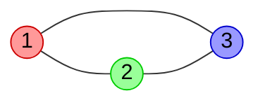

# Лекция 2. Сведение SAT

_Лекция написана студентом Соколовским Романом Вадимовичом из группы Б9123-01.03.02сп под руководством преподавателя Месенёва Павла Ростиславовича_

_В приведённом ниже материале используются термины и обозначения, введённые в [Лекции 1. Введение в NP](./../Лекция%201.%20Введение%20в%20NP/lecture.md)_

### Содержание

1. Полнота SAT
1. Сведение 3SAT к 3СOLOR
1. Источники

## 1. Полнота SAT

Проблема выполнимости, обозначаемая $SAT$, формулируется следующим образом: задана логическая формула $\phi$; определить, является ли она выполнимой. Очевидно, что $SAT \in NP$, т.к. удовлетворяющий набор значений переменных - это сертфикат $y$, и то, что $y$ действительно является удовлетворяющим набором значений переменных для $\phi$, может быть проверено за полиномиальное время.

Для начала стоит доказать, что $SAT$ является $NP$-Полной задачей, показав, что для каждого языка в $NP$ существует полиномиальное сведение к $SAT$. Тогда мы сможем утверждать, что любая задача, к которой сводится $SAT$ является $NP$-Полной. Почему это работает объяснено в [Лекции 1. Введение в NP](./../Лекция%201.%20Введение%20в%20NP/lecture.md).

**Теорема (С. Кук, Л. Левин).** $SAT$ является $NP$-Полной задачей.

> **Доказательство.** Рассмотрим только часть доказательства, так как это не основная тема лекции, а полная версия очень громоздкая.
>
> Рассмотрим задачу $A \in NP$. Она решается недетерминированной машиной Тьюринга $\mathfrak{M}$. Для удобства будет предполагать, что лента $\mathfrak{M}$ может увеличиваться бесконечно только вправо. Из определения $NP$, машина $\mathfrak{M}$ совершает не более $n^k$ шагов для успешного выполнения; мы можем утверждать, что длина ленты при вводе входных данных $x$ длины $n$ и далее на каждом шаге не превысит $n^k$, т.к. изначально головка $\mathfrak{M}$ стоит в начале ленты, двигается за один шаг максимум на одну ячейку вправо или влево и может в худшем случае сделать $n^k$ шагов вправо.
>
> Построим таблицу для данной $\mathfrak{M}$ и входных данных $x$. Пусть строки - это конфигурации машины (вид ленты) на кажом шаге, а столбцы - символы в соответсвутющей ячейке на каждом шаге. Для удобства доказательства в начало и конец ленты добавляют символ $\\#$. Вместе с символом состояния размер таблицы получается $(n^k + 3) \times (n^k + 3)$, но для удобства будем считать, что $n^k \times n^k$. Первая строка (стартовая конфигурация) имеет вид $(1)$:
>
> $$
> \begin{align*}
> \\# \ q_0 \ x_1 \ x_2 \ \ldots \ x_n \ \sqcup \ \ldots \ \sqcup \ \\# \\
> \longleftarrow n^k \longrightarrow
> \end{align*}
> $$
>
> Каждая следующая строка таблицы строится из предыдущей согласно правилам перехода в $\mathfrak{M}$.
>
> Таблица, построенная по этому приницпу, называется _принимающей_, если каждая строка является _принимающей_ конфигурацией. Иначе говоря, каждая принимающая таблица для $\mathfrak{M}$, построенная на входных данных $x$, соответствует успешному выполнению (одной из угаданных недетерминированной машиной ветке) при входных данных $x$. Таким, образом, задача определения того, принимает ли $\mathfrak{M}$ $x$, эквивалентна задаче определения того, существует ли принимающая таблица для $\mathfrak{M}$ на $x$.
>
> Далее строится булева формула $\phi$, разрешимость которой будет говорить о том, что таблица построенная на $\mathfrak{M}$ и $x$ является принимающей. Данная формула имеет вид:
>
> $$
> \phi = \phi_{cell} \wedge \phi_{start} \wedge \phi_{move} \wedge \phi_{accept}
> $$
>
> Здесь $\phi_{cell}$ требует, чтобы каждой ячейке в таблице соответствовала ровно одна переменная в формуле $\phi$; условие $\phi_{start}$ проверяет, чтобы стартовая конфигурация имела вид $(1)$; формула $\phi_{move}$ гарантирует, что все строки таблицы соответствуют правилам перехода $\mathfrak{M}$ и, наконец, $\phi_{accept}$ проверяет наличие состояния $q_F$ в последней строке. Вид самих формул опустим.
>
> Мы свели изначальный алгоритм проверки $x \in A$ к булевой формуле $\phi$. Теперь необходимо оценить количество переменных в формуле и время генерации этой формулы. Это мы также опустим и поверим, что $\phi$ строится за полиномиальное время на основе входных данных $x$.
>
> Таким образом, для каждого языка из $NP$ существует полиномиальное сведение к $SAT$. Следовательно, $SAT$ является $NP$-Полной задачей. ✌️

Всё это хорошо, но $SAT$ в некоторых случаях не очень удобен для сведения его к другим задачам, в отличии от его частного случая - $3SAT$. Формулы $3SAT$ являются КНФ с тремя переменными в одном из клозов $C_i, i \in \mathbb{N}$. Покажем, что $3SAT$ является $NP$-Полной задачей, путём доказательства существования полиномиального сведения $SAT$ к $3SAT$.

**Теорема (Г. Цейтин).** Для каждой булевой формулы $\phi$ существует равновыполнимая $3КНФ$ формула $\psi$, которая может быть вычислена за полиномиальное время.

> **Замечание.** _Равновыполнимость_ значит, что $\phi$ выполнима тогда и только тогда, когда $\psi$ выполнима (либо они обе удовлетворимые либо обе нет). Это более слабое условие в отличие от эквивалентности. Построить эквивалетную $3КНФ$ формулу не всегда представляется возможным или её построение может вести к экспоненциальному времени.

> **Доказательство (Трансформация Цейтина).** Для каждой подформулы (кроме простых переменных) $\xi_i$ у $\phi$ мы вводим новую переменную $t_i$ и соединяем её с этой подформулой эквивалентностью: $t_i \leftrightarrow \xi_i$. Например, для формулы $(p \rightarrow q) \vee (q \rightarrow (p \rightarrow q))$ полученные эквивалентнсти имеют вид:
>
> $$
> \begin{align*}
> t_1 &\leftrightarrow (p \rightarrow q) \\
> t_2 &\leftrightarrow (p \rightarrow r) \\
> t_3 &\leftrightarrow (q \rightarrow t_2) \\
> t_4 &\leftrightarrow (t_1 \vee t_3)
> \end{align*}
> $$
>
> Пусть последняя эквивалентность $t_n$ (в примере $n = 4$) соответсвует формуле $\phi$. Тогда коньюнкция всех эквивалентностей плюс t_n будет равновыполнима с $\phi$. То есть для нашего примера $\phi \equiv t_4 \wedge (t_4 \leftrightarrow (t_1 \vee t_3)) \wedge (t_3 \leftrightarrow (q \rightarrow t_2)) \wedge (t_2 \leftrightarrow (p \rightarrow r)) \wedge (t_1 \leftrightarrow (p \rightarrow q))$. После раскрытия эквивалентностей получим КНФ формулу с не более чем тремя переменными в одном клозе, т.к.
>
> $$
> \begin{align*}
> t_k &\leftrightarrow (t_i \wedge t_j) \equiv (\overline{t_i} \vee \overline{t_j} \vee t_k) \wedge (t_i \vee \overline{t_k}) \wedge (t_j \vee \overline{t_k})\\
> t_k &\leftrightarrow (t_i \vee t_j) \equiv (t_i \vee t_j \vee \overline{t_k}) \wedge (\overline{t_i} \vee t_k) \wedge (\overline{t_j} \vee t_k)\\
> t_k &\leftrightarrow (t_i \rightarrow t_j) \equiv (\overline{t_i} \vee t_j \vee t_k) \wedge (t_i \vee t_k) \wedge (\overline{t_j} \vee t_k) \\
> t_k &\leftrightarrow \overline{t_i} \equiv (t_i \vee t_k) \wedge (\overline{t_i} \vee \overline{t_k})
> \end{align*}
> $$
>
> Время выполнения такого алгоритма линейное (т.е. полиномиальное), т.к. мы просто итерируемся по всем операциям, составляя новую формулу. Таким образом, $SAT \leq_P 3SAT$ и $3SAT$ является $NP$-Полной задачей.

## 2. Сведение 3SAT к 3COLOR

**Определение.** $k$-раскраской графа $G(V, E)$ называется присвоение $k$ вершинам цветов $c: V \longrightarrow \\{1, 2, \ldots k\\}$. Говорят, что раскраска $c$ правильная, если $\forall (u, v) \in V c(u) \neq c(v)$, т.е. ни одна пара соединённых вершин не покрашена в один цвет.

_Задача минимальной покраски_ состоит в поиске минимального $k$ для правильной расркаски данного графа $G$.

**Определение.** Дан граф $G(V, E)$. Задача выполнимости $kCOLOR$ состоит в проверке того, что правильная раскраска $c$ графа $G$ использует макисмум $k$ цветов.

**Определение.** Дан граф $G(V, E)$. Задача выполнимости $3COLOR$ состоит в проверке того, что правильная раскраска $c$ графа $G$ использует макисмум $3$ цвета.



**Теорема.** $3COLOR$ явялется $NP$-Полной задачей.

> **Доказательство.** Для начала стоит сказать, что $3COLOR \in NP$. Это так, потому что при данном графе $G(V, E)$ и _сертфикате_ $c$ (в нашем случае это $3$-раскраска графа) мы можем проверить, что раскраска правильная за $O(n^2)$. Просто итерируемся по каждой вершине и проверяем, что все сжежные ей покрашены в другой цвет.
>
> Теперь сведём $3SAT$, т.е. $NP$-Полную задачу, к $3COLOR$ за полиномиальное время.
>
> Пусть дана булева формула $\phi$, являющаяся экземпляром задачи $3SAT$ и $C_1, C_2, \ldots, C_m$ - клозы в $\phi$ с переменными $\\{x_1, x_2, \ldots, x_n\\}$. Необходимо на основе $\phi$ сконструировать такой экземпляр задачи $3COLOR$ (т.е. граф $G(V, E)$), чтобы $G$ являлся $3$-раскрашиваемым тогда и только тогда, когда существует удовлетворяющий набор значений переменных $x_1, x_2, \ldots, x_n$ для $\phi$.
>
> Для начала определим три цвета, в которые будем красить граф. Обозначим их $T (TRUE), F (FALSE), B (BASE)$.
>
> Теперь начнём постепенно конструировать граф $G$. Основанием будет являться _треугольник из вершин_ $T, F, B$, т.е. три соединённые между собой вершины, покрашенные в соответствующие цвета.
>
> ```mermaid
> graph LR
>     F(( F )):::f
>     T(( T )):::t
>     B(( B )):::b
>     F --- T
>     T --- B
>     B --- F
>
> classDef f fill:#ff9999,stroke:#c00,color:#000;
> classDef t fill:#99ff99,stroke:#0c0,color:#000;
> classDef b fill:#9999ff,stroke:#00c,color:#000;
> ```
>
> Теперь добавим вершины $x_i$ и $\overline{x_i}$ для каждой переменной в $\phi$. Введём для них ограничение, по которому эти вершины могут быть покрашены только в цвета $T$ и $F$ (или $F$ и $T$). Добьёмся этого созданием треугольника $B, x_i,\overline{x_i}$ для каждой пары $(x_i, \overline{x_i}), i = \overline{1, n}$ (здесь $B$ - это вершина, покрашенная в соответствующий цвет на предыдущем шаге).
>
> ```mermaid
> graph BT
>     F(( F )):::f
>     T(( T )):::t
>     B(( B )):::b
>     F --- T
>     T --- B
>     B --- F
>     1(( x1 ))
>     -1(( ¬x1 ))
>     2(( x2 ))
>     -2(( ¬x2 ))
>     n(( xn ))
>     -n(( ¬xn ))
>     1 --- B
>     -1 --- B
>     1 --- -1
>     2 --- B
>     -2 --- B
>     2 --- -2
>     ...(( ⋯ )) --- B
>     n --- B
>     -n --- B
>     n --- -n
>
> classDef f fill:#ff9999,stroke:#c00,color:#000;
> classDef t fill:#99ff99,stroke:#0c0,color:#000;
> classDef b fill:#9999ff,stroke:#00c,color:#000;
> ```
>
> Теперь нам просто нужно добавить ограничения в $G$, чтобы зафиксировать выполнимость клозов из $\phi$. Для этого мы вводим _гаджет выполнимости клозов_, он же $OR$-гаджет. Этот гаджет важен, потому что он может быть трехцветным тогда и только тогда, когда хотя бы одна из переменных в клозе окрашена в $T$. Если все три переменные окрашены в $F$, то нет никакого способа раскрасить этот подграф, используя только $T$, $F$ и $B$.
>
> Пусть в $\phi$ существует клоз $C_p = (x_i \vee x_j \vee x_k)$, где $p \in \\{1, 2, \ldots, m\\}$. Тогда $OR$-гаджет, соответствующий этому клозу, имеет вид:
> $%обфускация леcгоу$
>
> ```mermaid
> graph LR
>     i(( xi ))
>     j(( xj ))
>     k(( xk ))
>     Cpi_(( ))
>     Cpj_(( ))
>     Cpk_(( ))
>     Cpi_j_(( ))
>     Cpi_j__(( ))
>     Cpi_j__k_(( Cp ))
>     i --- Cpi_
>     j --- Cpj_
>     k --- Cpk_
>     Cpi_ --- Cpj_
>     Cpi_ --- Cpi_j_
>     Cpj_ --- Cpi_j_
>     Cpk_ --- Cpi_j__k_
>     Cpi_j__ --- Cpi_j__k_
>     Cpi_j_ --- Cpi_j__
>     Cpk_ --- Cpi_j__
> ```
>
> Здесь вершины $x_i, x_j, x_k$ - это те же вершины графа $G$, которые мы добавили на прошлом шаге. Мы хотим, чтобы вершина $Cp$ была $TRUE$, если $C_p$ удовлетворим.
>
> У $OR$-гаджета есть два важных свойства:
>
> 1. Если $x_i, x_j, x_k$ все окрашены в $F$, то выходной узел $Cp$ $OR$-гаджета должен быть окрашен $F$. Таким образом имитируется неудовлетворимость клоза $C_i$
> 1. Если одна из переменных из $x_i, x_j, x_k$ окрашен в $T$, то существует правильная $3$-раскраска $OR$-устройства, в которой выходной узел $Cp$ окрашен в $T$. Таким образом, снова подтверждается выполнимость условия
>
> Мы почти закончили наше построение. Как только мы добавим $OR$-гаджет для каждого $C_p$, где $p = \overline{1, m}$, в $\phi$, мы соединим выходной узел $Ci$ каждого гаджета с вершинами $B$ и $F$ исходного треугольника следующим образом:
>
> ```mermaid
> graph LR
>     F(( F )):::f
>     T(( T )):::t
>     B(( B )):::b
>     i(( xi ))
>     j(( xj ))
>     k(( xk ))
>     Cpi_(( ))
>     Cpj_(( ))
>     Cpk_(( ))
>     Cpi_j_(( ))
>     Cpi_j__(( ))
>     Cpi_j__k_(( Cp ))
>     i --- Cpi_
>     j --- Cpj_
>     k --- Cpk_
>     Cpi_ --- Cpj_
>     Cpi_ --- Cpi_j_
>     Cpj_ --- Cpi_j_
>     Cpk_ --- Cpi_j__k_
>     Cpi_j__ --- Cpi_j__k_
>     Cpi_j_ --- Cpi_j__
>     Cpk_ --- Cpi_j__
>     Cpi_j__k_ --- B
>     Cpi_j__k_ --- F
>     B --- T
>     B --- F
>     T --- F
>
> classDef f fill:#ff9999,stroke:#c00,color:#000;
> classDef t fill:#99ff99,stroke:#0c0,color:#000;
> classDef b fill:#9999ff,stroke:#00c,color:#000;
> ```
>
> **Замечание.** Если клоз содержит меньше трёх переменных, то вместо нехватающих переменных в $OR$-гаджете просто используем вершину $F$. То есть, например, при наличии клоза $(x_i \vee x_j)$ мы представляем его в виде $(x_i \vee x_j \vee 0)$.
>
> Рассмотрим пример. Пусть $\phi \equiv (x_1 \vee x_2 \vee \overline{x_3}) \wedge (x_2 \vee x_3)$. Построенный по данным правилам граф $G$ будет иметь вид 🙈:
>
> ```mermaid
> graph LR
>     F(( F )):::f
>     T(( T )):::t
>     B(( B )):::b
>     B --- T
>     B --- F
>     T --- F
>     1(( x1 ))
>     -1(( ¬x1 ))
>     2(( x2 ))
>     -2(( ¬x2 ))
>     3(( x3 ))
>     -3(( ¬x3 ))
>     1 --- B
>     -1 --- B
>     1 --- -1
>     2 --- B
>     -2 --- B
>     2 --- -2
>     3 --- B
>     -3 --- B
>     3 --- -3
>     C11_(( ))
>     C12_(( ))
>     C11_2_(( ))
>     C11_2__(( ))
>     C1-3_(( ))
>     C11_2__-3_(( ))
>     1 --- C11_
>     2 --- C12_
>     C11_ --- C12_
>     C11_ --- C11_2_
>     C12_ --- C11_2_
>     C11_2_ --- C11_2__
>     -3 --- C1-3_
>     C11_2__ --- C1-3_
>     C11_2__ --- C11_2__-3_
>     C1-3_ --- C11_2__-3_
>     C11_2__-3_ --- B
>     C11_2__-3_ --- F
>     C22_(( ))
>     C23_(( ))
>     C22_3_(( ))
>     C22_3__(( ))
>     C2F_(( ))
>     C22_3__F_(( ))
>     2 --- C22_
>     3 --- C23_
>     C22_ --- C23_
>     C22_ --- C22_3_
>     C23_ --- C22_3_
>     C22_3_ --- C22_3__
>     F --- C2F_
>     C22_3__ --- C2F_
>     C22_3__ --- C22_3__F_
>     C2F_ --- C22_3__F_
>     C22_3__F_ --- B
>     C22_3__F_ --- F
>
> classDef f fill:#ff9999,stroke:#c00,color:#000;
> classDef t fill:#99ff99,stroke:#0c0,color:#000;
> classDef b fill:#9999ff,stroke:#00c,color:#000;
> ```
>
> Формула $\phi$ является удовлетворимой. Рассмотрим сертификат $c = 110$ (значения переменных $x_1, x_2, x_3$ соответственно). Попробуем раскрасить граф, присвоив вершинам $x_1, x_2, x_3$ цвета $T, T, F$:
>
> ```mermaid
> graph LR
>     F(( F )):::f
>     T(( T )):::t
>     B(( B )):::b
>     B --- T
>     B --- F
>     T --- F
>     1(( x1 )):::t
>     -1(( ¬x1 )):::f
>     2(( x2 )):::t
>     -2(( ¬x2 )):::f
>     3(( x3 )):::f
>     -3(( ¬x3 )):::t
>     1 --- B
>     -1 --- B
>     1 --- -1
>     2 --- B
>     -2 --- B
>     2 --- -2
>     3 --- B
>     -3 --- B
>     3 --- -3
>     C11_(( )):::b
>     C12_(( )):::f
>     C11_2_(( )):::t
>     C11_2__(( )):::f
>     C1-3_(( )):::b
>     C11_2__-3_(( )):::t
>     1 --- C11_
>     2 --- C12_
>     C11_ --- C12_
>     C11_ --- C11_2_
>     C12_ --- C11_2_
>     C11_2_ --- C11_2__
>     -3 --- C1-3_
>     C11_2__ --- C1-3_
>     C11_2__ --- C11_2__-3_
>     C1-3_ --- C11_2__-3_
>     C11_2__-3_ --- B
>     C11_2__-3_ --- F
>     C22_(( )):::b
>     C23_(( )):::t
>     C22_3_(( )):::b
>     C22_3__(( )):::t
>     C2F_(( )):::b
>     C22_3__F_(( )):::t
>     2 --- C22_
>     3 --- C23_
>     C22_ --- C23_
>     C22_ --- C22_3_
>     C23_ --- C22_3_
>     C22_3_ --- C22_3__
>     F --- C2F_
>     C22_3__ --- C2F_
>     C22_3__ --- C22_3__F_
>     C2F_ --- C22_3__F_
>     C22_3__F_ --- B
>     C22_3__F_ --- F
>
> classDef f fill:#ff9999,stroke:#c00,color:#000;
> classDef t fill:#99ff99,stroke:#0c0,color:#000;
> classDef b fill:#9999ff,stroke:#00c,color:#000;
> ```
>
> Раскраска является правильной.
>
> Теперь рассмотрим $\phi = x_1 \wedge \overline{x_1}$. Построенный по данным правилам граф $G$ будет иметь вид:
>
> ```mermaid
> graph LR
>     F(( F )):::f
>     T(( T )):::t
>     B(( B )):::b
>     B --- T
>     B --- F
>     T --- F
>     1(( x1 ))
>     -1(( ¬x1 ))
>     1 --- B
>     -1 --- B
>     1 --- -1
>     C11_(( ))
>     C1F_(( ))
>     C1F__(( ))
>     C11_F_(( ))
>     C11_F__(( ))
>     C11_F__F__(( ))
>     1 --- C11_
>     F --- C1F_
>     C11_ --- C1F_
>     C11_ --- C11_F_
>     C1F_ --- C11_F_
>     F --- C1F__
>     C11_F_ --- C11_F__
>     C11_F__ --- C1F__
>     C11_F__ --- C11_F__F__
>     C1F__ --- C11_F__F__
>     C11_F__F__ --- B
>     C11_F__F__ --- F
>     C2-1_(( ))
>     C2F_(( ))
>     C2F__(( ))
>     C2-1_F_(( ))
>     C2-1_F__(( ))
>     C2-1_F__F__(( ))
>     1 --- C2-1_
>     F --- C2F_
>     C2-1_ --- C2F_
>     C2-1_ --- C2-1_F_
>     C2F_ --- C2-1_F_
>     F --- C2F__
>     C2-1_F_ --- C2-1_F__
>     C2-1_F__ --- C2F__
>     C2-1_F__ --- C2-1_F__F__
>     C2F__ --- C2-1_F__F__
>     C2-1_F__F__ --- B
>     C2-1_F__F__ --- F
>
> classDef f fill:#ff9999,stroke:#c00,color:#000;
> classDef t fill:#99ff99,stroke:#0c0,color:#000;
> classDef b fill:#9999ff,stroke:#00c,color:#000;
> ```
>
> Этот граф нельзя раскрасить так, чтобы вершины $x_1$ и $\overline{x_1}$ имели разный цвет.
>
> Тепеь рассмотрим время работы алгоритма
